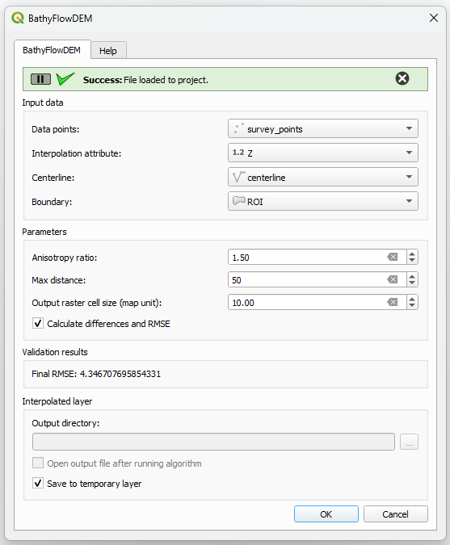

### BathyFlowDEM  Plugin for QGIS

      

    <h1>BathyFlowDEM</h1>
    This repository contains the code for the BathyFlowDEM, a QGIS plugin that creates digital elevation models from bathymetric data points using flow-oriented curvilinear coordinate system and anisotropic inverse distance weighting interpolation. 

## Introduction

| Main tab              | Output tab              | Help tab              |
| ---------------------- | ---------------------- | ---------------------- |
|  |  |  | 

## Functionalities

...

## Tools and requirements

Minimum QGIS version **3.X**.

Download QGIS [here](https://www.qgis.org/en/site/forusers/download.html)

- This plugin is being developed on **QGIS 3.28 LTR**. No other version have been tested at the moment
- The code is based on PyQGIS, [QGIS Python API](https://www.qgis.org/pyqgis/master/)
- Qt Designer for QGIS 3.28 LTR was used to create the UI layout.  

## Installation

### Locally

Download the master branch of this repository and move it to your QGIS active user's profile folder: 

`...\AppData\Roaming\QGIS\QGIS3\profiles\PROFILE_NAME\python\plugins`

To open the active profile's folder from QGIS, go to **Settings > User Profiles > Open Active User Profile**. 

Install to QGIS through the plugin manager. BathyFlowDEM is now available in the toolbar and in the QGIS plugin menu. 

> Note that if the plugin is manually uninstall from the plugin manager, it will delete the local folder.

After

### From QGIS plugin repository

...

## Contributing

If you have found a bug in this project, please report it in the [Issues](https://github.com/melindafemminis/BathyFlowDEM/issues) section of thie repository. 
Contributions and bug fixes are welcome !

## Author

This QGIS plugin is developped by Melinda Femminis.