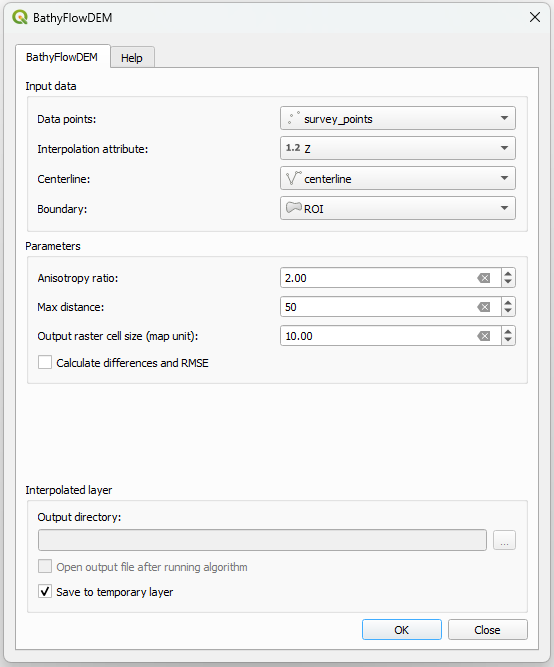
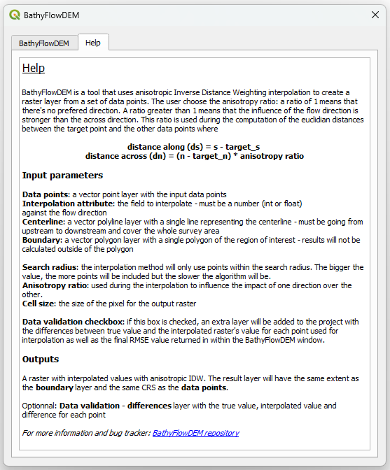
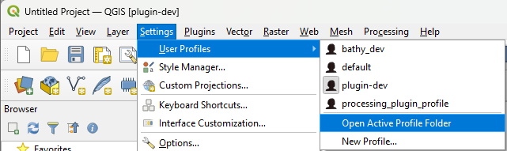

### BathyFlowDEM  Plugin for QGIS

      

<h1 align="center">BathyFlowDEM</h1>

This repository contains the code for the BathyFlowDEM, a QGIS plugin that creates digital elevation models from bathymetric data points using flow-oriented curvilinear coordinate system and anisotropic inverse distance weighting interpolation.

## Introduction

The goal of this project is to add an interpolation method with anisotropy to QGIS. With BathyFlowDEM, the user can decide the anisotropy ratio the best fit the data. While it was developped with bathymetric data in mind, it can be used with any point data with an attribute to interpolate. 

| Main tab              | Help tab              |
| ---------------------- |  ---------------------- |
|  |  | 

The plugin main window is split in 3 parts: 

- **Input data**: choose the layers to be used for interpolation 
- **Parameters**: define anisotropy ratio, maximum search distance for the IDW algorithm and the final raster cell size. The *Calculate differences and RMSE* checkbox calculate RMSE and provide an extra layer containing the points used for interpolation with their actual value, the final raster value at this point and the difference between them.
- **Interpolated layer**: option to save results to folder or create a temporary layer.

The *Help* tab provide some more information about the functionnalities of the plugin and the input and output layers. 

## Functionalities

At the moment, the plugin only has one interpolation method available

## Constaints and limitations

At the moment, the plugin only has one interpolation method available.

Applicable for single channel rivers, not braided rivers.

## Tools and requirements

Minimum QGIS version **3.X**.

Download QGIS [here](https://www.qgis.org/en/site/forusers/download.html)

- This plugin is being developed on **QGIS 3.28 LTR**. No other version have been tested at the moment
- The code is based on PyQGIS, [QGIS Python API](https://www.qgis.org/pyqgis/master/)
- Qt Designer for QGIS 3.28 LTR was used to create the UI layout.  

## Installation

### Locally

Download the master branch of this repository and move it to your QGIS active user's profile folder: 

`...\AppData\Roaming\QGIS\QGIS3\profiles\PROFILE_NAME\python\plugins`

To open the active profile's folder from QGIS, go to **Settings > User Profiles > Open Active User Profile**. 

Install to QGIS through the plugin manager. BathyFlowDEM is now available in the toolbar and in the QGIS plugin menu. 

> Note that if the plugin is manually uninstall from the plugin manager, it will delete the local folder.

After

### From QGIS plugin repository

...

## Contributing

If you have found a bug in this project, please report it in the [Issues](https://github.com/melindafemminis/BathyFlowDEM/issues) section of thie repository. 
Contributions and bug fixes are welcome !

## Author

This QGIS plugin is developped by Melinda Femminis.